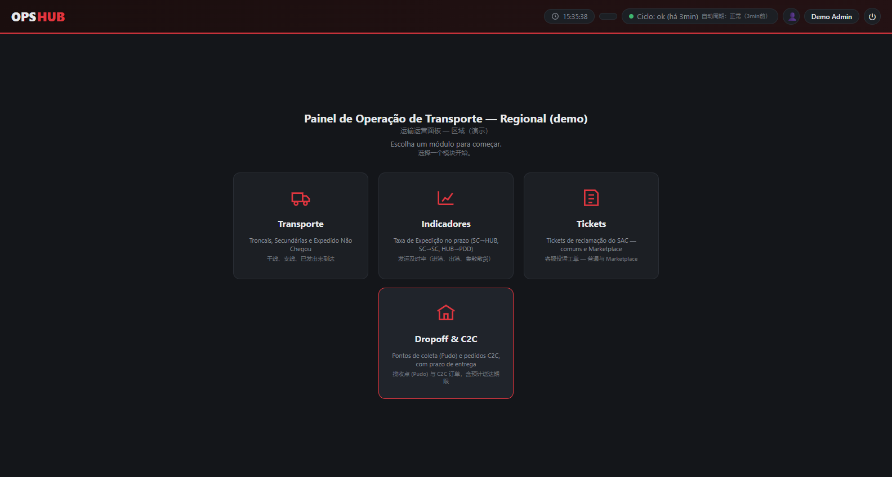
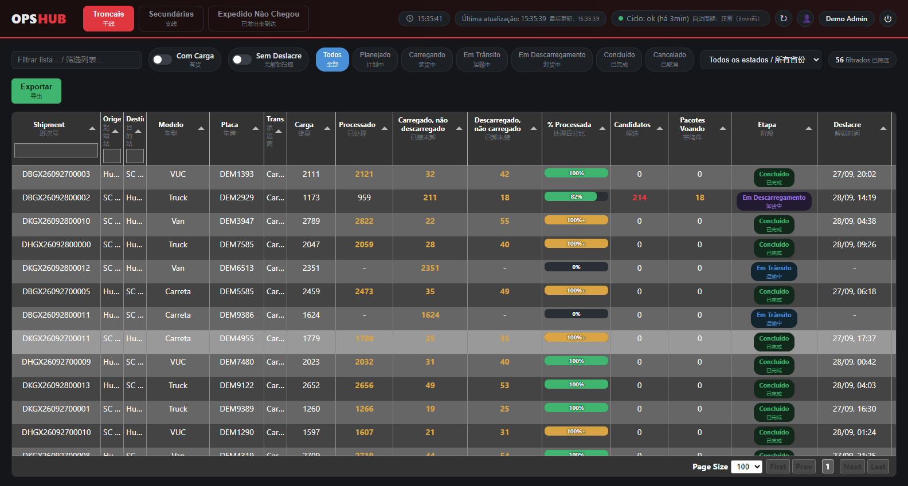
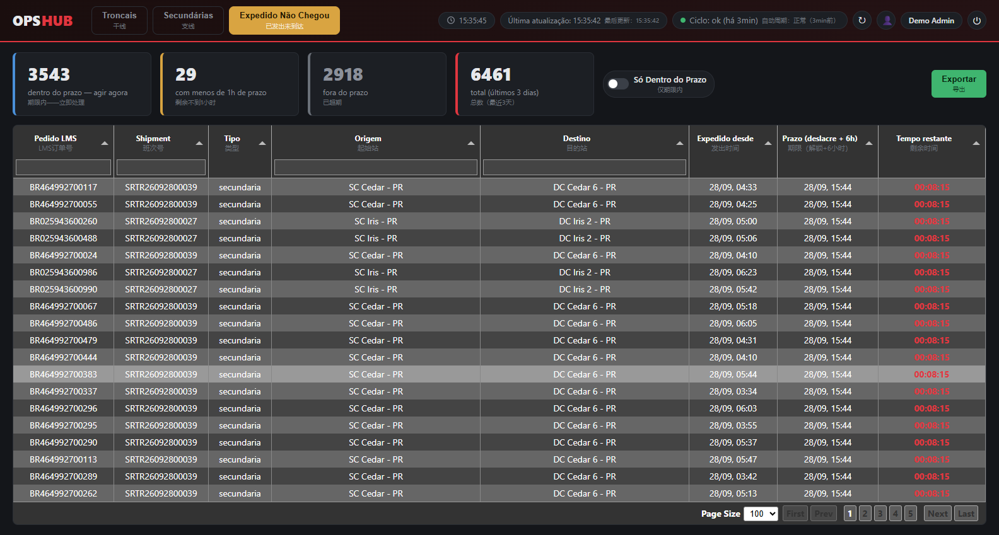
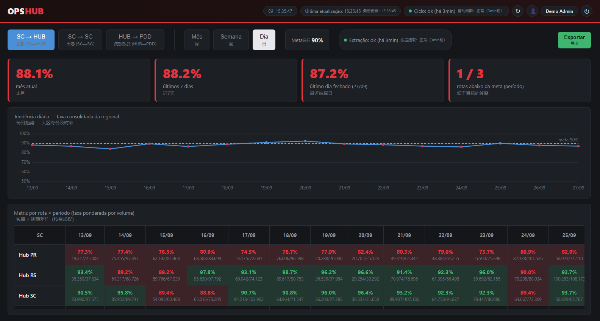
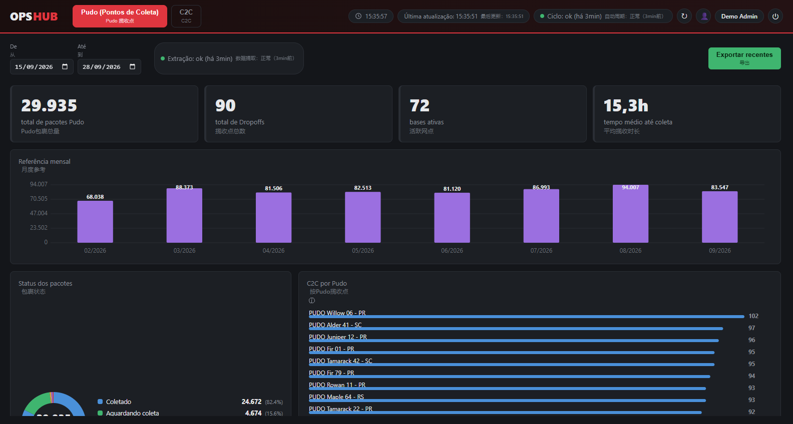
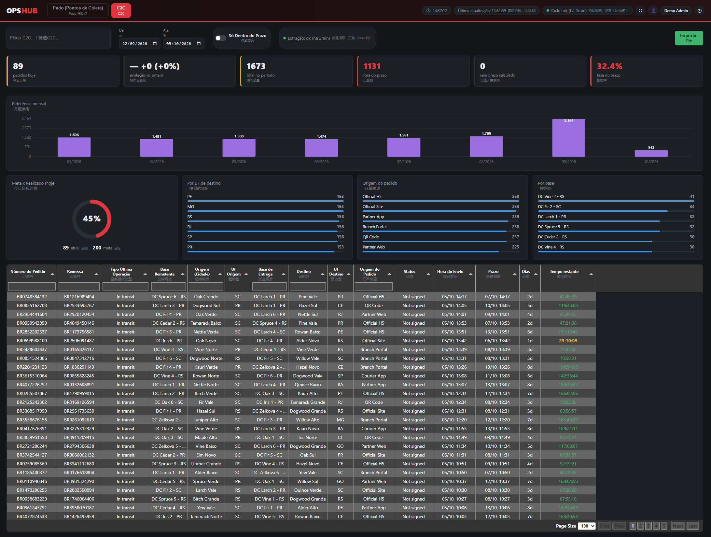
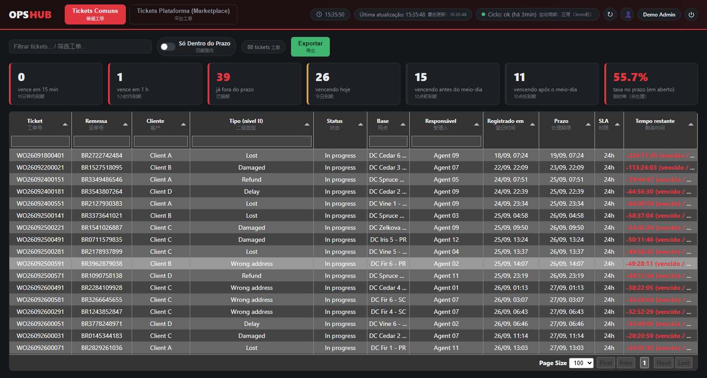

# Logistics Ops Dashboard

A live operations dashboard for a parcel-transport network: it tracks every
trunk and secondary trip, finds parcels that were **dispatched but never
arrived** *before* the responsibility window closes, and adds on-time-rate
indicators, customer-complaint tickets and drop-off / C2C volumes on top.

> **This repository runs entirely on synthetic data.** The network, trips,
> parcels, tickets and volumes are generated by a deterministic simulator
> (`etl/src/sources/demo.py`). It was built from a production system, but no
> real data, credentials, endpoints or company identifiers are included.



**Trips & progress** - every leg with stage, loaded/processed counts and an amber "100%+" bar when more parcels were unloaded than loaded:



**"Expedido nao chegou" candidates** - parcels loaded but not yet unloaded, with the countdown to the end of the 6-hour window:



**On-time rate indicators** - three rates with month / week / day views, target line and a route x period matrix:



**Drop-off points (Pudo)** - monthly reference, parcel status, C2C ranking per pickup point, daily volume and top cities / points / origins:



**C2C orders** - today vs. yesterday, on-time rate, monthly reference, daily goal gauge, breakdown by destination state / origin / base, and a filterable order table with the delivery-deadline countdown:



**Tickets** - open complaint tickets with SLA countdown:



## What it does

- **Transport module** - trunk and multi-stop secondary legs with stage
  (planned -> loading -> in transit -> unloading -> done), loaded / processed
  counts, seal/unseal times, and a per-leg parcel list.
- **"Expedido nao chegou" detection** - the 6-hour rule: from the moment a truck
  is unsealed, parcels loaded but not yet unloaded are candidates; near the
  deadline they are exported to `.xlsx` and pushed to a chat webhook.
- **"Flying parcels"** - parcels that show up unloaded without having been loaded
  by that trip (re-dispatch from backlog), reported separately instead of as errors.
- **Indicators** - three on-time rates (SC->HUB, SC->SC, HUB->PDD) with month /
  week / day views, a route x period matrix and a target line.
- **Tickets** - open complaint tickets with SLA countdown (common + marketplace).
- **Drop-off & C2C** - pickups at partner points and consumer-to-consumer orders,
  delivery deadline per municipality, date-range filters, permanent daily/monthly history.
- **Operations** - health badge per job, stuck-cycle alert, self-healing watchdog,
  user administration.

## Engineering highlights

- **Pluggable data source.** The ETL only knows a `DataSource` contract with
  neutral shapes; a synthetic source ships by default, a real adapter is a
  drop-in (`etl/src/sources/README.md`).
- **Set-comparison arrival logic** (loaded vs. unloaded per shipment) with two
  precision tiers to keep an hourly cycle affordable.
- **Cross-process throttle** in one Postgres row: global request spacing +
  concurrency cap + **automatic recovery of leaked slots** from killed processes
  (`etl/src/common/throttle.py`, integration-tested).
- **Three-tier retention**: rolling detail (pruned by the jobs themselves) -> permanent
  daily totals -> permanent monthly totals, with the daily job needing no upstream calls.
- **Observability by table**: every job logs status, rows written, error and
  duration; a separate job alerts when the main cycle stops.
- **Security basics done right**: httpOnly signed session cookie, bcrypt,
  generic login errors, admin rights checked in the DB on every request, random
  temporary passwords, refuses to boot without a session secret.
- **No build step** on the frontend: vanilla JS + Tabulator, hand-written SVG
  charts, bilingual (PT / ZH) labels, mtime-based cache busting.
- **Lessons learned** from running it against a live third-party system are
  written up in [`docs/ENGINEERING_NOTES.md`](docs/ENGINEERING_NOTES.md).

## Stack

PostgreSQL - Python 3 (pandas, psycopg2) - Node.js / Express - vanilla JS,
Tabulator, SVG. ~3k lines Python, ~1.3k Node, ~3.3k frontend, ~500 SQL.

**How the data gets from an existing system into PostgreSQL and out to the UI (extract, load, consume, and the whole ETL):** [`docs/DATA_PIPELINE.md`](docs/DATA_PIPELINE.md).

Architecture diagrams: [`docs/ARCHITECTURE.md`](docs/ARCHITECTURE.md).
Scheduling and backfill runbook: [`docs/SCHEDULING.md`](docs/SCHEDULING.md).
Incidents and lessons learned: [`docs/ENGINEERING_NOTES.md`](docs/ENGINEERING_NOTES.md).

## The ETL pipeline, end to end

Nothing in this system talks to an external source directly - every job asks a
`DataSource` (`etl/src/sources/base.py`) for neutral data and writes to
PostgreSQL. Ten independent, short-lived jobs cover the whole pipeline; a
scheduler (cron, Windows Task Scheduler, ...) owns the cadence, not the jobs
themselves. Full cadence table and backfill commands: [`docs/SCHEDULING.md`](docs/SCHEDULING.md).

```text
 1. run.py                     hourly    Core cycle: pulls every trunk/secondary
                                          leg, derives its stage from timestamps,
                                          matches loaded vs. unloaded parcels per
                                          shipment, decides "Expedido nao chegou"
                                          candidates, writes the .xlsx and pushes
                                          the webhook alert. See src/main.py.

 2. run_carga_processado.py    ~20 min   Lighter follow-up: refreshes only the
                                          loaded/processed counters for legs that
                                          departed recently, so a multi-stop route
                                          getting its unload scan hours later
                                          doesn't wait for the next full hour.

 3. run_pudo.py                hourly    Drop-off (partner pickup point) volumes,
                                          self-healing window (last few hours).
 4. run_c2c.py                 30 min    Consumer-to-consumer orders + delivery
                                          deadline per municipality, self-healing
                                          window (last few days).

 5. run_taxas.py                3 h      Three on-time-rate indicators
                                          (SC->HUB, SC->SC, HUB->PDD).
 6. run_tickets.py             15 min    Snapshot of still-open complaint tickets
                                          (full replace per run - a closed ticket
                                          simply stops appearing).

 7. run_diario.py              00:20     Permanent DAILY totals for pudo/c2c,
                                          aggregated with pure local SQL from what
                                          jobs 3-4 already wrote (no source calls).
 8. run_mensal.py              02:00     Permanent MONTHLY totals (current + prior
                                          month), the "other months" reference on
                                          the charts.

 9. verificar_ciclo.py         20 min    Watches execucoes_etl from OUTSIDE job 1:
                                          alerts if the core cycle hasn't
                                          succeeded in 2h (a check living inside
                                          the cycle could never fire once the
                                          cycle itself stops running).
10. watchdog_painel.ps1        10 min    Infra-level: checks the API/tunnel from
                                          outside the app and restarts the right
                                          Windows service after a second failed
                                          health check.
```

Every job in 1-8 writes one row to its own `execucoes_*` table per run
(status, rows written, error, duration) - that's what feeds the health badges
in the UI and is how job 9 knows the core cycle is stuck. See
[`docs/ARCHITECTURE.md`](docs/ARCHITECTURE.md) for the full "Expedido nao chegou"
decision flow and the three-tier retention diagram (rolling detail ->
permanent daily -> permanent monthly).

Run the whole pipeline once against fresh data with `python seed_demo.py`
(schema + every job 1-8 in sequence, plus 30 days of history - see *Quick
start* below). Jobs 9-10 are infrastructure watchdogs, not part of the seed.

## Quick start

Requirements: Python 3.10+, Node 18+, PostgreSQL 14+ (or Docker).

```bash
cp .env.example .env            # set PGPASSWORD and SESSION_SECRET
docker compose up -d db         # or point PG* at your own PostgreSQL

# 1) ETL + demo data
cd etl
python -m venv .venv && . .venv/bin/activate      # Windows: .venv\Scripts\activate
pip install -r requirements.txt
python seed_demo.py             # schema + 30 days of synthetic history (~1 min)

# 2) API + frontend
cd ../api
npm install
node scripts/criar_usuario.js demo "Demo Admin" --admin   # prints a one-time password
npm start                       # http://localhost:3001
```

Log in as `demo` with the printed password. Re-run `python run.py` (or any
`run_*.py`) at any time: the simulator advances with the clock, so trips move
through their stages.

### Tests

```bash
cd etl
python -m unittest discover -s tests -v
```

Unit tests cover the business rules (stage derivation, 6-hour rule, status
decision, loaded/processed aggregation - including a regression test for the
"processed clamped to loaded" bug) and the determinism/consistency of the demo
source. The throttle tests need a PostgreSQL and are skipped without `PG*` vars.

## Configuration

Everything is environment-driven; see [`.env.example`](.env.example).

| Variable | Meaning |
|---|---|
| `DATA_SOURCE` | `demo` (default) or a custom source you register |
| `DEMO_SEED` | seed of the simulator |
| `PRAZO_LIMITE_HORAS` | hours between unseal and responsibility change (default 6) |
| `SESSION_SECRET` | required; signs session cookies |
| `COOKIE_SECURE` | `true` behind HTTPS, `false` for plain localhost |
| `FEISHU_WEBHOOK_URL` | optional chat alert; empty = disabled |

## Project layout

Full tree - every file, so it's clear how the three layers (ETL, API, frontend)
and the docs fit together:

```text
db/
  schema.sql                   PostgreSQL schema, idempotent (CREATE ... IF NOT EXISTS)

etl/
  requirements.txt
  seed_demo.py                 bootstraps schema + 30 days of demo history end to end
  run.py                       job 1  - core cycle (legs, parcels, candidates, alert)
  run_carga_processado.py      job 2  - fast loaded/processed refresh
  run_pudo.py                  job 3  - drop-off volumes (self-healing)
  run_c2c.py                   job 4  - C2C orders + delivery deadline (self-healing)
  run_taxas.py                 job 5  - on-time-rate indicators
  run_tickets.py               job 6  - open-tickets snapshot
  run_diario.py                job 7  - permanent daily totals
  run_mensal.py                job 8  - permanent monthly totals
  verificar_ciclo.py           job 9  - stuck-cycle alert (runs outside run.py)
  src/
    config.py                  all settings, env-driven, no secrets/URLs hardcoded
    db.py                      connection + generic upsert helper
    main.py                    the core cycle logic used by run.py
    common/
      throttle.py               cross-process rate limiter (spacing + concurrency cap + leak recovery)
      utils.py                  stage derivation, text normalization
    services/
      status.py                 arrival decision (loaded vs. unloaded set comparison)
      carga_processado.py       loaded/processed aggregation per leg
      responsavel.py            6-hour responsibility rule
      exportador.py             .xlsx export of near-deadline candidates
      alerta_feishu.py          webhook alert (candidates + stuck-cycle)
    sources/
      base.py                   the DataSource contract (Protocol) every source must implement
      demo.py                   synthetic, deterministic source - ships by default
      README.md                 how to plug in a real adapter
  tests/
    test_business_rules.py      stage/6h-rule/status/aggregation unit tests
    test_demo_source.py         determinism & consistency of the demo source
    test_throttle_integration.py  throttle behavior against a real PostgreSQL
    test_retention_integration.py pacotes retention: prunes only idle rows, never live ones

api/
  package.json
  scripts/criar_usuario.js     CLI to create a user with a random temporary password
  src/
    server.js                  Express app, static frontend, cache-busted index.html
    db.js                      pg Pool
    senhaTemporaria.js         random temporary-password generator
    middleware/auth.js         session cookie check + admin check (DB-backed)
    routes/
      auth.js                   login / logout / me
      pernas.js                 trunk & secondary legs list
      pernaDetalhe.js            parcels of one leg
      pacotes.js                 parcel search
      candidatos.js              "Expedido nao chegou" candidates
      taxasExpedicao.js          on-time-rate indicators
      tickets.js                 complaint tickets
      dropoff.js                 drop-off (Pudo) & C2C
      execucoes.js               job health/history for the UI badges
      usuarios.js                 user administration (admin-only)
      bases.js                    network catalog

frontend/
  index.html                    single page, hash-routed modules
  favicon.svg
  css/estilo.css
  js/app.js                     all UI logic - tables, SVG charts, routing, no build step

infra/
  watchdog_painel.ps1           job 10 - API/tunnel health check + restart

docs/
  DATA_PIPELINE.md              extract -> PostgreSQL on localhost -> consume, and the whole ETL
  ARCHITECTURE.md               diagrams: context, arrival logic, retention tiers, security
  ENGINEERING_NOTES.md          9 real incidents and what each one taught
  SCHEDULING.md                 cadence table, cron/Windows examples, backfill commands
  img/                          screenshots used in this README (synthetic data)

.github/workflows/ci.yml       unit + integration tests, full demo seed, JS syntax check
docker-compose.yml             PostgreSQL only, for local development
.env.example                   every environment variable, documented
```

## Limitations / roadmap

- Code identifiers and comments are mostly Portuguese (the UI is PT + ZH); an
  English pass over the codebase is planned.
- No login rate limiting or password-change flow yet.
- The production adapter for the original system is intentionally not part of this
  repository.

## Resumo em portugues

Painel de operacao de transporte que acompanha viagens Troncais e Secundarias,
detecta pacotes **"Expedido nao chegou"** antes de a responsabilidade mudar de
base (regra das 6 horas) e oferece indicadores de taxa no prazo, tickets de
reclamacao e volumes de pontos de coleta / C2C. **Todo o conteudo deste
repositorio e' sintetico**: nenhum dado, credencial ou identificador real da
operacao original foi incluido. Para rodar: veja *Quick start* acima; o
simulador (`etl/src/sources/demo.py`) gera a operacao inteira.

## License

MIT - see [LICENSE](LICENSE).
