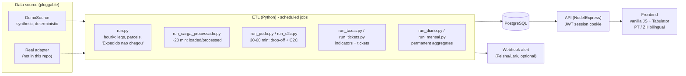
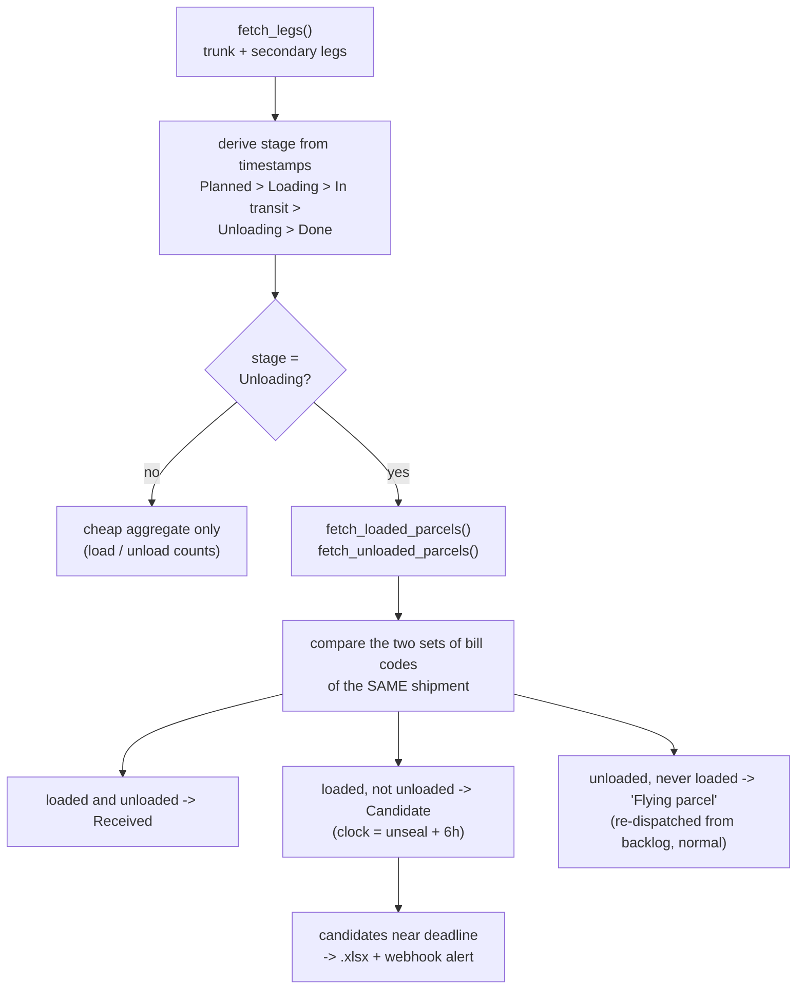
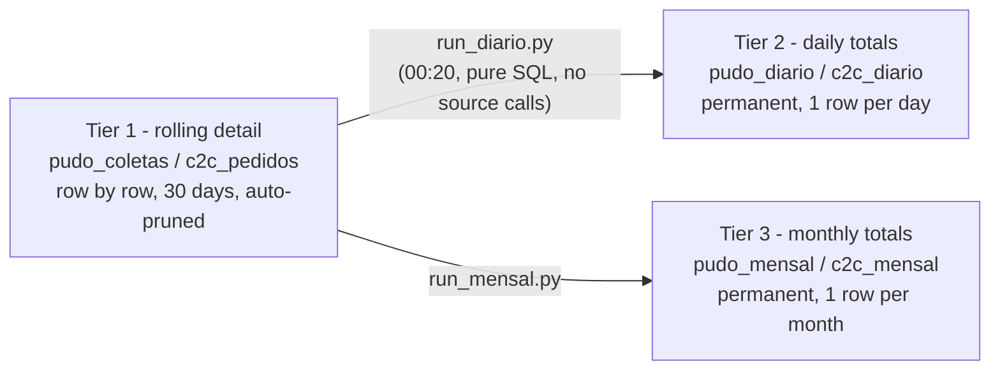

# Architecture

## Context

The ETL never talks to an external system directly. It asks a `DataSource`
(`etl/src/sources/base.py`) for **neutral** structures, so every business rule
below is independent of where the data comes from. Swapping the source does not
touch the pipeline.

## The core problem: "Expedido nao chegou" (dispatched, never arrived)

A truck is sealed at the origin, travels, and is unsealed at the destination.
From the **unseal** moment a **6-hour** clock starts: until it expires the
responsibility for a missing parcel belongs to the base that dispatched it;
after that it moves to the base that unloaded. The system finds those parcels
*before* the clock runs out so an operator can register the anomaly in time.

Design decisions worth calling out:

- **Arrival is decided by set comparison** (loaded vs. unloaded per shipment),
  not by trusting a status field. This was validated numerically against the
  source's own aggregate ("loaded but not unloaded").
- **Two precision levels** keep the hourly cycle affordable: a cheap aggregate
  for every leg that already departed, and the per-parcel comparison only for
  legs currently unloading (the only ones where the anomaly can still appear).
- **Multi-stop secondary routes**: one `shipment_no` has several legs. A
  parcel is matched to a leg by its **next stop**, not by its final destination
  (see `docs/ENGINEERING_NOTES.md` - the mistake that silently dropped ~98% of
  parcels).
- **Loaded is per truck, unloaded is per stop.** The load event applies to all
  eligible stops of the shipment; each unload event matches only its own stop.
- **"Processed" is never clamped to "loaded".** Unloading more than was loaded
  is real information (flying parcels). Only the progress *bar* is capped at
  100% in the UI, and turns amber ("100%+") when the true value exceeds it.

## Data model (22 tables)

| Area | Tables |
|---|---|
| Network & trips | `bases`, `pernas` (legs), `pacotes` (parcels) |
| Observability | `execucoes_etl`, `execucoes_taxas`, `execucoes_dropoff`, `execucoes_carga_processado`, `execucoes_mensal` |
| Indicators | `taxas_expedicao` (3 on-time rates), `tickets_reclamacao` |
| Drop-off / C2C | `pudo_coletas`, `c2c_pedidos`, `abrangencia_prazos` (delivery-time reference) |
| Long-term history | `pudo_diario`, `c2c_diario`, `pudo_mensal`, `c2c_mensal` |
| Platform | `usuarios`, `throttle_global` |

### Three-tier retention for high-volume data

Drop-off pickups reach tens of thousands of rows per day, so keeping everything
forever is not an option - but the history must survive.

The daily job runs just after midnight and aggregates the *previous* (closed)
day from the rolling tier using only local SQL, so it is cheap and cannot be
hurt by source instability.

## Cross-process throttle (`etl/src/common/throttle.py`)

Several scheduled jobs (separate processes) call the same gateway. A per-process
limit does not add up, so a single Postgres row coordinates them:

- **Spacing**: `ultima_chamada` is a global queue; each call atomically reserves
  the next slot in one `UPDATE`.
- **Concurrency cap**: `em_andamento` counts open calls across all processes.
- **Leak self-healing**: a process killed hard never returns its slot.
  `slot_atualizado_em` detects "cap full and nothing moving for N minutes" and
  resets the counter automatically.
- **Fail-open**: if Postgres is down, it falls back to a local throttle instead of
  blocking the cycle.

Covered by integration tests (`etl/tests/test_throttle_integration.py`): cap
respected under 9 threads, slot released on exceptions, leaked-slot recovery.

## API and security

- Express, PostgreSQL via `pg`, no ORM. The API holds **no business rules** - it
  reads what the ETL wrote.
- Session = signed JWT in an `httpOnly` cookie (`sameSite=lax`, `secure` by
  default). The app **refuses to start** without `SESSION_SECRET`.
- Passwords are hashed with bcrypt (cost 12). Login errors are generic (no
  account enumeration). Admin rights are checked **in the database on every
  admin request**, not trusted from the token, so demoting or disabling an
  account takes effect immediately.
- New accounts get a **random temporary password** shown once (only the hash is
  stored). There is no predictable default-password convention.
- Known gaps (deliberately out of scope for the demo): no login rate limiting,
  no password-change flow, no CSRF token beyond `sameSite`.

## Frontend

Vanilla JS + [Tabulator](https://tabulator.info/), **no build step**. A hash
router (`#/transporte/troncais`) lazy-loads each report only when opened. Charts
are hand-written SVG (bars, donut, gauge, horizontal bars). Every label is
bilingual (Portuguese / Chinese) because the operation is bilingual. Static
assets are served with mtime-based cache busting so a deploy is never masked by
a stale browser cache.

## Reliability

- **Observability by table**: every job writes one row per run (status, rows
  written, error, duration); the UI shows a health badge from it.
- **Stuck-cycle alert** (`verificar_ciclo.py`): a *separate* job alerts when the
  main cycle has not succeeded for 2 h. An alert emitted from inside the cycle
  could never fire when the cycle itself stops running.
- **Watchdog** (`infra/watchdog_painel.ps1`): checks the API locally first, then
  the public URL, restarts the right service only after a second failed check,
  and logs whether the cure worked.
