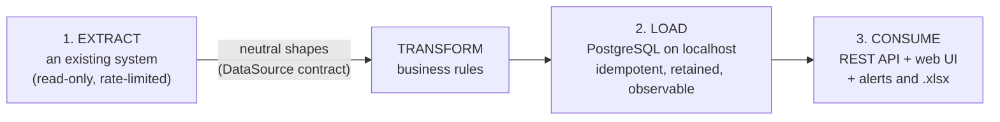
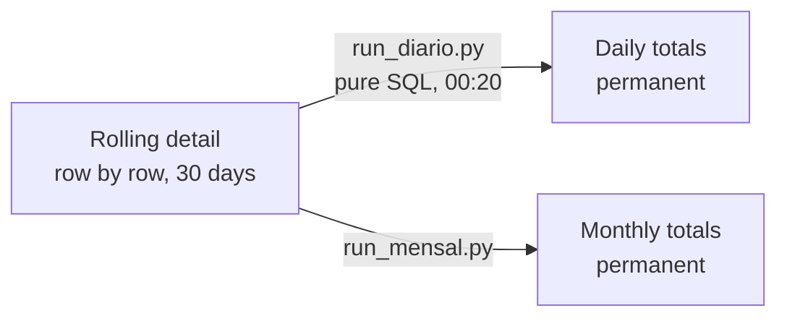
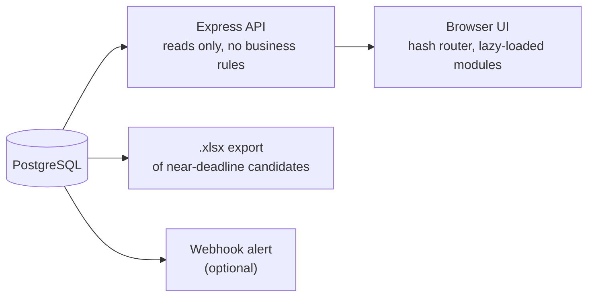
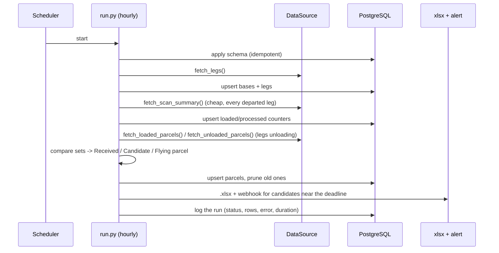

# From an existing system to a dashboard: the data pipeline

How data travels from a system we do not control, into a PostgreSQL database
on `localhost`, and out to the people who use it. Three stages, one ETL.



The business rules (the "T") sit **between** extraction and storage and know
nothing about either side. That is what makes the system testable and the source
replaceable (see [`etl/src/sources/README.md`](../etl/src/sources/README.md)).

---

## Stage 1 - Extracting from an existing system

The source is an internal operations platform with no public integration API.
The goal was to read from it **continuously, without harming it, and without
trusting it blindly**.

### How the work was approached

1. **Find where the screens get their data.** Each report the operators already
   use in the web UI is backed by a request; those reports were catalogued
   (what it returns, what filters it takes, how it paginates).
2. **Validate against a human.** Every extractor was checked against numbers an
   operator had produced by hand (spreadsheet cross-checks, the platform's own
   aggregate columns) before being trusted. One rule - "arrived" decided by
   comparing loaded vs. unloaded parcels - was validated by checking that it
   matched the platform's own aggregate figure exactly, not just "looked right".
3. **Isolate everything behind one contract.** The extractors speak the platform's
   language; the rest of the code speaks ours. The contract is
   [`etl/src/sources/base.py`](../etl/src/sources/base.py).

### Making extraction safe and reliable

| Concern | What was done |
|---|---|
| **Not overloading the source** | A global throttle shared by every job process: request spacing + a cap on simultaneous calls ([`throttle.py`](../etl/src/common/throttle.py)). |
| **Authentication cost** | A session token is cached in the database and re-used; a full re-login happens only when a cheap health check fails. |
| **Transient failures** | Retry with back-off for connection errors and for the source's own "try again" codes. |
| **Fragile pagination** | For large reports, use the source's own bulk **export job** (trigger, poll, download one file) instead of paging through hundreds of pages. |
| **Silent changes upstream** | Required columns are asserted; a renamed column fails loudly instead of discarding every row. |
| **Data that lags** | Each job re-reads a *window* (hours or days) rather than "since last run", so late data heals itself. |

### In this repository

The real extractors are not included. `DATA_SOURCE=demo` selects
[`etl/src/sources/demo.py`](../etl/src/sources/demo.py): a deterministic
simulator that returns exactly the same neutral shapes - a fictional network
(3 hubs, 12 sorting centres, 72 delivery bases), multi-stop trips, parcels,
tickets and pickup-point volumes that **advance with the clock**. Same seed and
same instant give identical data, which is what the tests rely on.

---

## Stage 2 - Building the PostgreSQL database on localhost

### Run it yourself

```bash
cp .env.example .env              # PGPASSWORD, SESSION_SECRET
docker compose up -d db           # PostgreSQL 16 on localhost:5432 (or use your own server)
cd etl && python seed_demo.py     # applies db/schema.sql, then runs every job once
```

`seed_demo.py` is the whole bootstrap: schema, reference data, then the real
jobs in order, then 30 days of history. Nothing is hand-inserted.

### Design principles

- **One idempotent schema file** ([`db/schema.sql`](../db/schema.sql)). Every
  statement is `CREATE ... IF NOT EXISTS` / `ADD COLUMN IF NOT EXISTS`, so it is
  safe to apply on every cycle and to upgrade a live database in place.
- **Upsert, never "insert and hope".** Every write goes through one helper
  ([`db.upsert_muitos`](../etl/src/db.py)) using `INSERT ... ON CONFLICT DO UPDATE`
  on a natural key. Re-running a job, overlapping windows and retries are all
  harmless.
- **Natural keys that match the domain.** For example a leg is unique on
  `(shipment_no, leg_type, destination)` because one secondary shipment has
  several stops - discovering that the shipment id alone was *not* unique was an
  early lesson ([`ENGINEERING_NOTES.md`](ENGINEERING_NOTES.md)).
- **Store the truth, present the clamp.** Counters are stored as measured. Display
  limits (a bar capped at 100%) live in the UI, never in the database.

### The tables, by how they live

| Lifecycle | Tables | Policy |
|---|---|---|
| **Reference** | `bases`, `abrangencia_prazos` | Small, replaced when the source changes |
| **Operational, rolling** | `pernas`, `pacotes`, `pudo_coletas`, `c2c_pedidos` | Pruned automatically (30-day window) |
| **Snapshots** | `tickets_reclamacao`, `taxas_expedicao` | Replaced per run / keyed per day |
| **History, permanent** | `pudo_diario`, `c2c_diario`, `pudo_mensal`, `c2c_mensal` | Aggregates only, never deleted |
| **Observability** | `execucoes_etl`, `execucoes_taxas`, `execucoes_dropoff`, `execucoes_carga_processado`, `execucoes_mensal` | One row per job run |
| **Platform** | `usuarios`, `throttle_global` | Accounts; the shared rate-limiter row |



High-volume tables would grow without bound, so detail is kept only for a
rolling window; long-term history survives as aggregates. Retention is
enforced **by the jobs themselves** (`_podar_*`), not by a manual clean-up.

### Keeping it healthy

- **Retention in code.** Each rolling table has a prune step that runs after the
  write. A prune failure is logged and never fails the cycle.
- **Don't delete what is still alive.** `pacotes` is pruned only when a row was
  *neither detected nor updated* inside the window; a parcel still being updated
  is never removed (covered by `test_retention_integration.py`).
- **No dead tables.** A table that no code reads or writes is removed from the
  schema, not left "just in case".
- **Reclaiming space.** Deleting rows does not shrink the file;
  `VACUUM (FULL) <table>` does, at the price of an exclusive lock, so it is run
  in a quiet moment with a short `lock_timeout` and retried.
- **Trust, but verify before dropping an index.** Index-usage counters reset after
  an unclean shutdown, so "never used" is not proof; check real query plans first.

---

## Stage 3 - Consuming the data



- **The API reads, the ETL decides.** Every rule (stage, arrival, responsibility,
  deadlines) is computed once, in the ETL, and stored. The API only filters,
  joins and aggregates what is already there, so the UI can never disagree with
  the alert or the spreadsheet.
- **Auth** is a signed, `httpOnly` session cookie; passwords are bcrypt hashes;
  admin rights are re-checked in the database on every admin request.
- **UI**: vanilla JS + Tabulator, no build step. Each module (Transport,
  Indicators, Tickets, Drop-off & C2C) loads its data only when opened, and a
  health badge is built from the `execucoes_*` tables - so an operator can see,
  without a terminal, whether the data on screen is fresh.
- **Outputs besides the screen**: a `.xlsx` of parcels close to the end of their
  6-hour window, and a chat-webhook alert while any remain.

---

## The ETL, end to end



| # | Job | Cadence | Extract | Transform | Load |
|---|---|---|---|---|---|
| 1 | `run.py` | hourly | legs, scan summary, loaded/unloaded parcels, audit status | stage from timestamps; arrival by set comparison; 6-hour rule | `pernas`, `pacotes`, `bases`, `execucoes_etl` |
| 2 | `run_carga_processado.py` | ~20 min | scan summary only | per-stop loaded/processed | counters on `pernas` |
| 3 | `run_pudo.py` | hourly | pickup-point parcels, last hours | - | `pudo_coletas` (+ prune) |
| 4 | `run_c2c.py` | 30 min | C2C orders, last days | delivery deadline per municipality | `c2c_pedidos` (+ prune) |
| 5 | `run_taxas.py` | 3 h | 3 on-time-rate reports, last 3 closed days | - | `taxas_expedicao` |
| 6 | `run_tickets.py` | 15 min | open tickets | SLA deadline | `tickets_reclamacao` (replace) |
| 7 | `run_diario.py` | 00:20 | *none - local SQL* | daily totals | `pudo_diario`, `c2c_diario` |
| 8 | `run_mensal.py` | 02:00 | month totals | monthly totals | `pudo_mensal`, `c2c_mensal` |
| 9 | `verificar_ciclo.py` | 20 min | *none - reads run log* | "no success for 2 h?" | alert |
| 10 | `watchdog_painel.ps1` | 10 min | HTTP health checks | restart after a 2nd failure | service restart |

Properties every job shares:

- **Idempotent** - re-running, overlapping or retrying never duplicates or corrupts.
- **Self-healing windows** - each run re-reads a recent window instead of "since
  last run". After a long outage, backfill explicitly
  ([`SCHEDULING.md`](SCHEDULING.md)).
- **Observable** - one row per run in an `execucoes_*` table, including **rows
  written**, because a run that "succeeds" while writing nothing is the most
  dangerous failure ([`ENGINEERING_NOTES.md`](ENGINEERING_NOTES.md), item 1).
- **Independent** - a failing report never stops the others; a failed save of one
  window never aborts the remaining windows.
- **Tested** - business rules are unit-tested without a database; the throttle
  and the retention policy are integration-tested against a real PostgreSQL.
